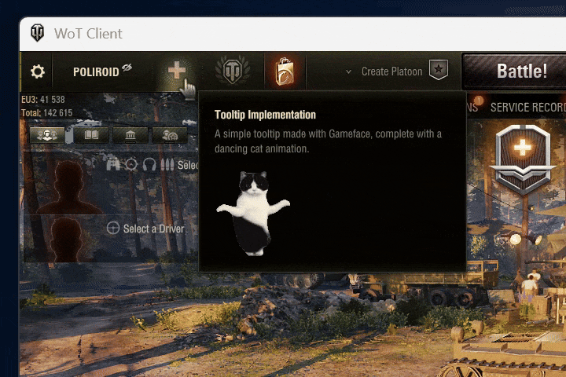

## Usage

This module has two core functions: managing `res_map.json` and injecting resources into Gameface views.

First, it helps integrate mod resources into the game’s `res_map.json`. It automatically merges the game’s original resources with mod-added ones into a single validated file. This is essential for adding any new game resources, such as UI layouts, localization strings, or images.

Second, it provides a Gameface resource injector to dynamically inject custom resources (CSS and JavaScript) into Gameface views, allowing mods to alter or extend the game's UI.

The injection process is straightforward:
1.  **Prepare your resources**: Create your CSS stylesheets and JavaScript files.
2.  **Register resources**: Use the `gf_mod_inject` function in your Python `ViewModel` to register the paths to your resources. This makes them available to the injector.
3.  **Automatic Injection**: A script (`gui/gameface/js/index.js`) automatically loads in every Gameface view. It detects the registered resources from your `ViewModel` and injects them into the DOM, applying your styles and executing your scripts.

### Key Features

- **Resource Mapping**: Automatically merges the game's `res_map.json` with multiple mod resources into a single, validated file. This is a crucial feature for adding new UI elements, localizations, or any other game resource.
- **Dynamic Gameface Injection**: Allows for the injection of CSS styles and JavaScript files (both classic scripts and ES modules) directly into Gameface views.
- **Ready-to-Use JS Libraries**: A collection of pre-built JavaScript modules (`gui/gameface/mods/libs/`) is provided to simplify common tasks like interacting with the game engine, managing view state, handling sounds, and creating responsive layouts.
- **Safe Resource Access**: Exposes Python utilities to safely retrieve mod resource IDs from the `UiResourceManager` using full keys or partial masks.
- **Event-Based Loading**: Provides an event-driven mechanism to ensure your code runs only after the `res_map.json` has been validated.
- **Automated Game Restart**: Ensures the game restarts when necessary to apply a new `res_map.json`, guaranteeing that resource changes are loaded correctly.

---

## Main Components

- **`ModDynAccessor`**: A subclass of `DynAccessor` that delays resolution of its `resId` until `res_map.json` is validated. Accepts a `modID` string and resolves it automatically.
- **`on_ready(callback: Callable)`**: Registers a callback to be executed once `res_map.json` has been validated. If validation has already occurred, the callback is executed immediately.
- **`res_id_by_key(key: str) -> Optional[int]`**: Searches for an exact match of a `modID` and returns the corresponding `UiResourceManager` `itemID`. Returns `None` if the key is not found.
- **`res_ids_by_mask(mask: str) -> Iterator[Tuple[str, int]]`**: Iterates over all registered `modID`s and yields those that contain the given substring.
- **`ModInjectModel(ViewModel)`**: A `ViewModel` that provides resource lists (styles, scripts, modules) for the JS-side injector.
- **`gf_mod_inject(model, name, styles=None, scripts=None, modules=None)`**: Adds the `ModInjectModel` as a property to another `ViewModel`, making the resource lists available to the JS-side injector.

---

### Example 1: Using ModDynAccessor

```python
from openwg_gameface import ModDynAccessor

class _TestDialog(ModDynAccessor):
  title = ModDynAccessor('mods/testDialog/title')
  cancel = ModDynAccessor('mods/testDialog/cancel')
  submit = ModDynAccessor('mods/testDialog/submit')

TestDialog = _TestDialog()
```

---

### Example 2: Get `UiResourceManager` itemID by `modID`

```python
import openwg_gameface

@openwg_gameface.on_ready
def handle_res_map():
  tooltipLayoutID = openwg_gameface.res_id_by_key('mods/testTooltip/layoutID')
```

---

### Example 3: Finding All Matching Items

```python
import openwg_gameface
from gui.impl.gen_utils import DynAccessor, INVALID_RES_ID

@openwg_gameface.on_ready
def handle_res_map():
  mapping = dict(openwg_gameface.res_ids_by_mask('mods/testDialog'))

  class _TestDialog(DynAccessor):
    title = DynAccessor(mapping.get('mods/testDialog/title', INVALID_RES_ID))
    cancel = DynAccessor(mapping.get('mods/testDialog/cancel', INVALID_RES_ID))
    submit = DynAccessor(mapping.get('mods/testDialog/submit', INVALID_RES_ID))

  TestDialog = _TestDialog()
```

---

### Example 4: Injecting resources into a ViewModel

To inject your custom styles and scripts into a Gameface view, you need to call `gf_mod_inject` from your `ViewModel`'s `_initialize` method.

```python
from openwg_gameface import gf_mod_inject

class MyViewModel(ViewModel):
    def _initialize(self, *args, **kwargs):
        super(MyViewModel, self)._initialize(*args, **kwargs)
        gf_mod_inject(self, 'MyModAlias',
            styles=['coui://gui/gameface/mods/MyMod/style.css'],
            modules=['coui://gui/gameface/mods/MyMod/script.js']
        )
```

This makes the specified resources available to a JavaScript-side injector (`gui/gameface/js/index.js`), which dynamically loads them into the view. The `name` parameter (`'MyModAlias'`) is used to map the resources on the JavaScript side.

---

### Mod Configuration Format

Mod configuration files must be JSON and placed in either:

- Real filesystem: `mods/configs/res_map/*.json`
- Game VFS (virtual filesystem): same relative path

Each configuration file must contain a list of items. Each item **must** include:

- `itemID` (string): A **required** and **unique** identifier used in your mod code.

The `itemID` will **not** appear in the final `res_map.json` file; it is only used by the manager to link mod-defined items to the actual resource entries in the game's resource manager and enable lookups by this ID.

**All other key-value pairs** in the item will pass through into the final resource map under a uniquely generated hexadecimal key.

**Example:**

```json
[
  {
    "itemID": "mods/testDialog/title",
    "type": "String",
    "parameters": {
      "key": "Dialog window made with Unbound (WULF)",
      "textdomain": "dialogs",
      "extension": ""
    }
  },
  {
    "itemID": "mods/testTooltip/layoutID",
    "type": "Layout",
    "path": "coui://gui/gameface/mods/testTooltip/TestTooltip.html",
    "parameters": {
      "extension": "",
      "entrance": "TestTooltip",
      "impl": "gameface"
    }
  }
]
```

---

### JavaScript-Side Injection Logic

The injection process is handled by `gui/gameface/js/index.js`, a script that is automatically loaded into every Gameface view. This script is responsible for dynamically injecting resources (like CSS and JS) from mods into the current view.

**How it works:**
1. It iterates through all available subviews (`window.subViews`).
2. It looks for subviews that have a `ModInjectModel` in their data model. This special model acts as a signal that the subview contains resources intended for injection.
3. If a `ModInjectModel` is found, the injector injects the specified resources (e.g., CSS, JS) into the currently active view.
4. To prevent duplicate injections, it tracks which subviews have already been processed and injects their resources only once.

---

### JavaScript-Side Libraries

A collection of pre-built JavaScript modules is available in `gui/gameface/mods/libs/` to simplify common tasks in Gameface views. You can import these modules into your own scripts to interact with the game engine, manage views, handle media queries, and more.

**Available Modules:**

-   **`media.js`**: Offers a `MediaContext` for subscribing to screen resize and scale change events, allowing you to create responsive components.
-   **`model.js`**: Includes a `ModelObserver` to subscribe to data changes in the main view model or any subview model, helping you react to state updates.
-   **`sound.js`**: A simple module with a `playSound` function to trigger in-game sound effects.
-   **`views.js`**: A comprehensive module for interacting with the game's view system, including functions to show/hide tooltips (`showTooltip`, `hideTooltip`) and popovers (`showPopover`).
-   **`common.js`**: Provides utility functions for unit conversions (`pxToRem`, `remToPx`) and getting the current screen size and scale.
-   **`debug.js`**: Contains tools for debugging, such as `debugObject` to log complex objects and `debugElement` to inspect DOM element structures.

To use these modules, simply import them into your JavaScript files:
```javascript
import { playSound } from '../libs/sound.js';

document.getElementById('myButton').addEventListener('mouseenter', () => {
  playSound('highlight');
});
```

---

## Use Cases

### Gameface

Adding a custom Gameface window requires registering it with the game's ResourceManager.



### Unbound (WULF)

Interfaces in UNBOUND that rely on ResourceManager for data fields, like this simple window:


---

### Logic Flow for Combined `res_map.json` Lifecycle


